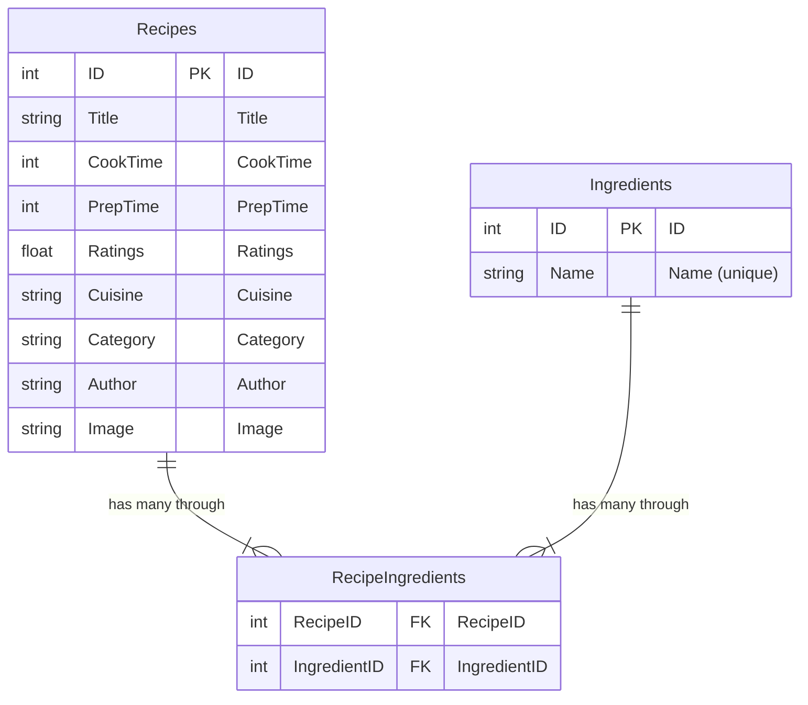

# dinnertime
Get some recipes based on the ingredients you have available at home.

# Data Model

The recipes are scraped from the internet to then be stored in the database. 
We have a dataset that is an array of objects, each object representing a recipe.

```json
{
  "title": "Golden Sweet Cornbread",
  "cook_time": 25,
  "prep_time": 10,
  "ingredients": [
    "1 cup all-purpose flour",
    "1 cup yellow cornmeal",
    "⅔ cup white sugar",
    "1 teaspoon salt",
    "3 ½ teaspoons baking powder",
    "1 egg",
    "1 cup milk",
    "⅓ cup vegetable oil"
  ],
  "ratings": 4.74,
  "cuisine": "",
  "category": "Cornbread",
  "author": "bluegirl",
  "image": "https://imagesvc.meredithcorp.io/v3/mm/image?url=https%3A%2F%2Fstatic.onecms.io%2Fwp-content%2Fuploads%2Fsites%2F43%2F2021%2F10%2F26%2Fcornbread-1.jpg"
}
```

The database schema is as follows:



There is a simplification in the data model, due to the way we are receiving the ingredients. 

```"1 cup all-purpose flour"```

On a later stage, we could split the ingredient into the name and quantity when ingesting the data.
This would allow a more complex and complete data model, we would consider the ingredient as a table where each ingredient 
has a food item and quantities.
Therefore, there would be another table for food items, that also would allow to have more detailed info about each food
like calories, proteins, etc.

Here is an example of a [nutrition system](https://alejandromarco.notion.site/Nutrici-n-f6406bf639cc44688f64b71af2c0f3c9)
I created where you can see the data model for a more complex system. This allows calculating total calories or easier
searching for recipes based on the nutritional values.
