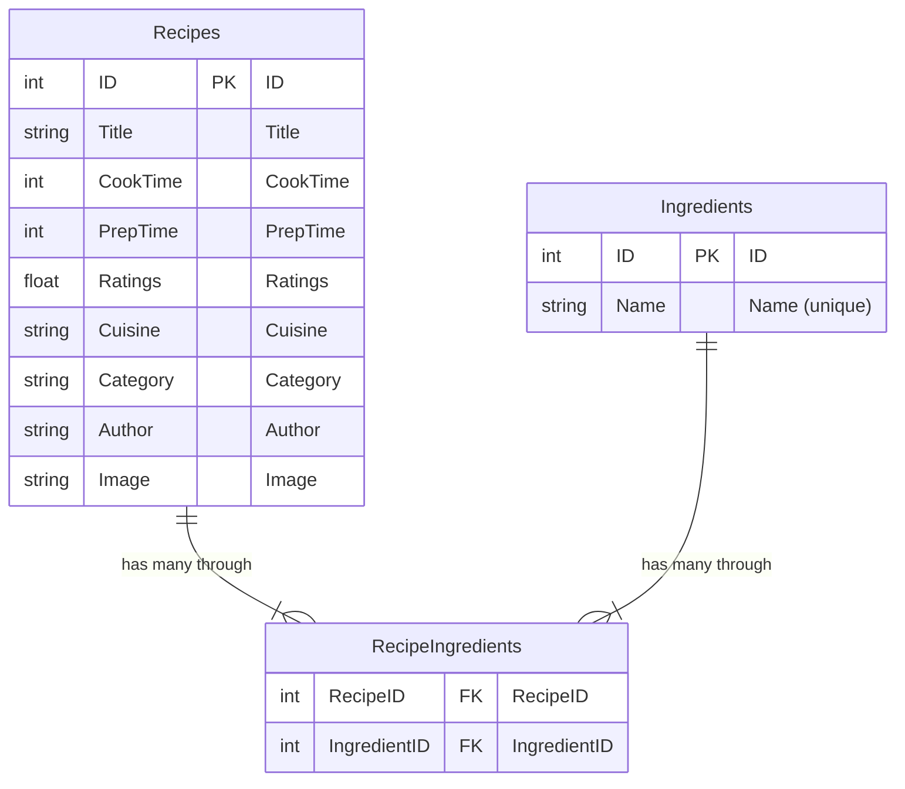

# dinnertime
Get some recipes based on the ingredients you have available at home.

# Data Model

```mermaid
erDiagram
    Recipes {
        int ID PK "ID"
        string Title "Title"
        int CookTime "CookTime"
        int PrepTime "PrepTime"
        float Ratings "Ratings"
        string Cuisine "Cuisine"
        string Category "Category"
        string Author "Author"
        string Image "Image"
    }

    Ingredients {
        int ID PK "ID"
        string Name "Name (unique)"
    }

    RecipeIngredients {
        int RecipeID FK "RecipeID"
        int IngredientID FK "IngredientID"
    }

    Recipes ||--|{ RecipeIngredients : "has many through"
    Ingredients ||--|{ RecipeIngredients : "has many through"

```
